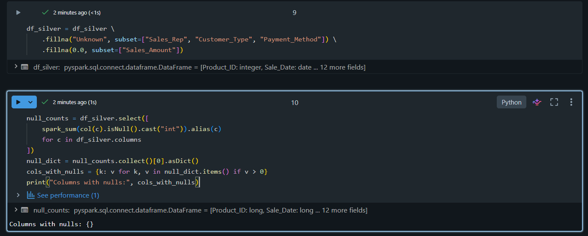
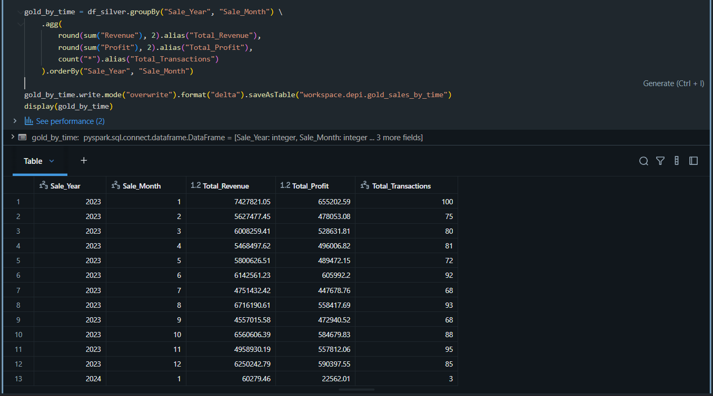
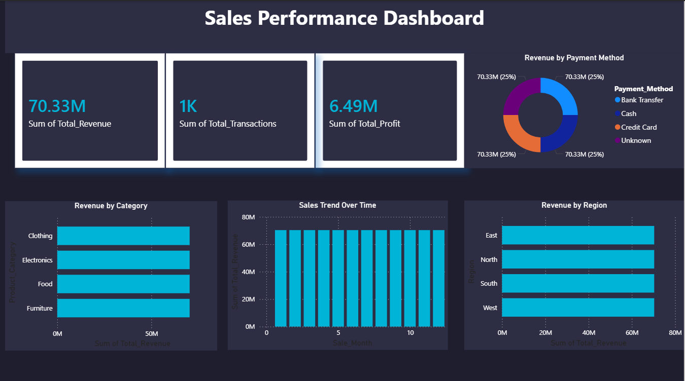

# 🏆 Sales Data Engineering Pipeline — Medallion Architecture on Databricks

A complete end-to-end **Data Engineering project** built on **Databricks** using the **Medallion Architecture (Bronze → Silver → Gold)**, transforming raw CSV sales data into business-ready insights visualized in **Power BI**.

---

## 📐 Architecture Overview

```
CSV Sales Data (ADLS Volume)
        │
        ▼
┌─────────────────┐
│   Bronze Layer  │  ← Raw ingestion, no transformations
│ depi_bronze_sales│
└────────┬────────┘
         │
         ▼
┌─────────────────┐
│   Silver Layer  │  ← Cleaning, enrichment, null handling
│ depi_silver_sales│
└────────┬────────┘
         │
         ▼
┌──────────────────────────────────────┐
│              Gold Layer              │  ← Business-ready aggregations
│  gold_kpi_summary                    │
│  gold_sales_by_region                │
│  gold_sales_by_category              │
│  gold_sales_by_time                  │
│  gold_sales_by_payment               │
└────────────────────┬─────────────────┘
                     │
                     ▼
          ┌─────────────────┐
          │  Power BI       │  ← Interactive Dashboard
          │  Dashboard      │
          └─────────────────┘
```

---

## 🛠️ Technologies Used

| Tool | Purpose |
|---|---|
| **Databricks** | Cloud data platform |
| **Apache Spark / PySpark** | Distributed data processing |
| **Delta Lake** | Storage format for all layers |
| **Unity Catalog** | Data governance & table management |
| **Power BI** | Business Intelligence & visualization |
| **Python** | Transformation logic |

---

## 📁 Project Structure

```
├── bronze_layer.ipynb       # Raw data ingestion
├── silver_layer.ipynb       # Data cleaning & transformation
├── gold_layer.ipynb         # Business aggregations
├── screenshots/             # Project screenshots
└── README.md
```

---

## 🥉 Bronze Layer

**Goal:** Ingest raw CSV sales data as-is into a Delta table with no transformations.

**Dataset columns:**
`Product_ID`, `Sale_Date`, `Sales_Rep`, `Region`, `Sales_Amount`, `Quantity_Sold`, `Product_Category`, `Unit_Cost`, `Unit_Price`, `Customer_Type`, `Discount`, `Payment_Method`, `Sales_Channel`, `Region_and_Sales_Rep`, `DataSource`

**What happens:**
- Load CSV from ADLS Volume with schema inference
- Add `DataSource` metadata column
- Save as Delta table: `workspace.depi.depi_bronze_sales`
- **1,000 rows | 15 columns**

---

## 🥈 Silver Layer

**Goal:** Clean, transform, and enrich the Bronze data.

### Transformations Applied

| Step | Action |
|---|---|
| Drop columns | Removed `Region_and_Sales_Rep` (redundant) and `DataSource` (constant) |
| Null simulation | Introduced nulls in `Sales_Rep`, `Customer_Type`, `Payment_Method`, `Sales_Amount` |
| Null handling | Filled string nulls with `"Unknown"`, numeric nulls with `0.0` |
| Revenue | `Unit_Price × Quantity_Sold` |
| Profit | `(Unit_Price - Unit_Cost) × Quantity_Sold` |
| Discount Amount | `Sales_Amount × Discount` |
| Date extraction | `Sale_Month`, `Sale_Year`, `Day_of_Week` from `Sale_Date` |

### Silver Layer — Null Handling


### Silver Layer — Final Data After Transformations


**Output:** `workspace.depi.depi_silver_sales`

---

## 🥇 Gold Layer

**Goal:** Create business-ready aggregations as Delta tables for BI reporting.

### Gold Tables

| Table | Description |
|---|---|
| `gold_kpi_summary` | Total Revenue, Transactions, Profit |
| `gold_sales_by_region` | Revenue, Profit, Quantity per Region |
| `gold_sales_by_category` | Revenue, Profit, Quantity per Product Category |
| `gold_sales_by_time` | Monthly Revenue & Profit trends |
| `gold_sales_by_payment` | Revenue breakdown by Payment Method |

### Key Results

**By Region:**
| Region | Total Revenue | Total Profit |
|---|---|---|
| North | $18,208,403 | $1,661,461 |
| East | $18,077,401 | $1,650,557 |
| West | $17,761,568 | $1,656,091 |
| South | $16,282,567 | $1,519,736 |

**By Category:**
| Category | Total Revenue | Total Profit |
|---|---|---|
| Clothing | $19,286,733 | $1,712,957 |
| Furniture | $18,330,280 | $1,779,461 |
| Electronics | $17,571,040 | $1,574,320 |
| Food | $15,141,885 | $1,421,108 |

---

## 📊 Power BI Dashboard

Connected Power BI Desktop directly to Databricks via the SQL Warehouse connector.

**Dashboard includes:**
- 💰 **Total Revenue** KPI Card — $70.33M
- 📦 **Total Transactions** KPI Card — 1,000
- 📈 **Total Profit** KPI Card — $6.49M
- 🍩 **Revenue by Payment Method** — Donut Chart
- 📊 **Revenue by Category** — Bar Chart
- 📊 **Revenue by Region** — Bar Chart
- 📅 **Sales Trend Over Time** — Column Chart

### Dashboard Preview


---

## 🚀 How to Run

1. Upload `sales_data.csv` to your Databricks ADLS Volume
2. Create a schema named `depi` in your Unity Catalog workspace
3. Run notebooks in order:
   - `bronze_layer.ipynb`
   - `silver_layer.ipynb`
   - `gold_layer.ipynb`
4. Connect Power BI Desktop to Databricks using SQL Warehouse connection details
5. Load the Gold tables and build your dashboard

---

## 👤 Author

**Mohamed Arafa**
Computer Science — Egypt-Japan University of Science and Technology (E-JUST)
DEPI Program — AI & Data Engineering Track
